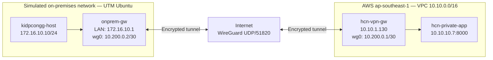

# Hybrid Cloud Network Lab

A hands-on hybrid networking project that connects a simulated on-premises Linux LAN on macOS to a private application in AWS through a routed WireGuard site-to-site VPN.

**Status:** Core implementation complete and validated end to end.

## Project outcome

This lab demonstrates how a workload without direct cloud access can reach an application in an AWS private subnet through two Linux gateways and an encrypted tunnel. The final validation originated inside the simulated on-premises LAN, traversed WireGuard, reached the private EC2 instance, and returned a successful HTTP response.

Key results:

- Built a simulated on-premises LAN with a Linux network namespace and a veth pair.
- Created an AWS VPC with separate public and private subnets.
- Configured an EC2 instance as a WireGuard VPN gateway.
- Kept the application EC2 instance private, with no public IPv4 address.
- Implemented bidirectional routing without NAT between the on-premises LAN and AWS.
- Restricted administrative access to a single public `/32` CIDR.
- Disabled EC2 source/destination checking on the VPN gateway so it can forward traffic.
- Imported the manually created AWS environment into Terraform state.
- Managed 16 AWS resources with Terraform and reached a clean `No changes` plan.
- Enabled VPC Flow Logs with CloudWatch Logs delivery.
- Captured packet, tunnel, routing, SSH, ICMP, and HTTP evidence.

## Architecture



The public subnet provides Internet reachability to the AWS VPN gateway. The application remains in the private subnet and is reachable from the on-premises network only through the routed WireGuard tunnel.

## Addressing plan

| Network or host | Address | Purpose |
|---|---:|---|
| AWS VPC | `10.10.0.0/16` | Cloud address space |
| AWS public subnet | `10.10.1.0/24` | VPN gateway subnet |
| AWS VPN gateway | `10.10.1.130` | Routes between the VPC and WireGuard |
| AWS private subnet | `10.10.10.0/24` | Private application subnet |
| Private application | `10.10.10.7:8000` | HTTP test service without a public IP |
| WireGuard tunnel | `10.200.0.0/30` | Point-to-point VPN network |
| AWS WireGuard interface | `10.200.0.1/30` | Cloud tunnel endpoint |
| On-premises WireGuard interface | `10.200.0.2/30` | Local tunnel endpoint |
| Simulated on-premises LAN | `172.16.10.0/24` | Local workload network |
| Simulated host | `172.16.10.10/24` | Source of end-to-end tests |
| On-premises gateway | `172.16.10.1/24` | Default next hop for the simulated host |

## Packet flow

### Request path

1. `kidpcongg-host` sends traffic from `172.16.10.10` toward `10.10.10.7`.
2. Its route sends the packet to the on-premises gateway at `172.16.10.1`.
3. The gateway forwards the packet to `wg0` because `10.10.10.0/24` is included in the AWS peer's WireGuard `AllowedIPs`.
4. WireGuard encrypts and transports the packet over UDP/51820 to the AWS VPN gateway.
5. The AWS gateway decrypts and forwards the original packet into the VPC.
6. The VPC local route delivers it to the application at `10.10.10.7`.

### Return path

1. The private application replies to the original source, `172.16.10.10`.
2. The private route table sends `172.16.10.0/24` to the VPN gateway network interface.
3. The AWS gateway selects the on-premises WireGuard peer through `AllowedIPs` and encrypts the reply.
4. The on-premises gateway decrypts and forwards the packet to `kidpcongg-host` through the veth pair.

The design uses routing rather than NAT for hybrid traffic, so the application sees the original on-premises source address.

## AWS design

| Component | Design decision |
|---|---|
| Public subnet | Hosts only the VPN gateway required to accept the WireGuard endpoint connection |
| Private subnet | Hosts the application without a public IPv4 address |
| Internet Gateway | Provides Internet connectivity for the public subnet |
| Public route table | Sends `0.0.0.0/0` to the Internet Gateway |
| Private route table | Sends `172.16.10.0/24` to the VPN gateway ENI |
| VPN Security Group | Allows SSH and UDP/51820 only from the current administrator `/32` CIDR |
| Application Security Group | Allows ICMP and TCP/8000 from `172.16.10.0/24`, and SSH from the VPN gateway |
| Source/destination check | Disabled only on the VPN gateway because it forwards packets for other hosts |
| VPC Flow Logs | Captures accepted and rejected VPC traffic and delivers it to CloudWatch Logs |

## Terraform

The AWS network was first built manually for learning, then imported into Terraform without replacing the working infrastructure.

The migration procedure was:

1. Describe the existing AWS resources with the AWS CLI.
2. Write Terraform resources that matched the deployed configuration.
3. Generate and review import plans.
4. Reject any plan that proposed unexpected replacement or destruction.
5. Import the existing resources with `0 added, 0 changed, 0 destroyed`.
6. Add the missing private route-table association through a reviewed plan.
7. Enable VPC Flow Logs through a separate reviewed plan.
8. Confirm that the final plan reported `No changes`.

Terraform manages the VPC, subnets, Internet Gateway, route tables, route-table associations, Security Groups, EC2 instances, CloudWatch log group, Flow Logs IAM role and policy, and the VPC Flow Log.

```bash
cd infra/terraform
terraform init
terraform fmt -check
terraform validate
terraform plan
```

Create a local variable file from the example and use the administrator's current public IPv4 address as a `/32`:

```hcl
admin_cidr = "203.0.113.10/32"
```

Terraform state, saved plans, credentials, private keys, and real `.tfvars` files are excluded from Git.

> Terraform manages the AWS infrastructure. WireGuard keys, operating-system configuration, and application installation are separate guest configuration steps and are not presented as zero-touch provisioning.

## Local LAN recreation

Linux network namespaces do not survive a reboot. Copy the version-controlled script to the Ubuntu gateway, then use it to recreate the simulated host, veth pair, addresses, and routes:

```bash
scp scripts/start-local-lan.sh \
  cloud_lab@192.168.64.5:/home/cloud_lab/start-local-lan.sh

ssh cloud_lab@192.168.64.5
chmod +x ~/start-local-lan.sh
sudo ~/start-local-lan.sh
```

The script is idempotency-aware: it checks whether `kidpcongg-host` already exists before attempting to create it again.

## Validation

### Tunnel status

```bash
sudo wg show wg0
ping -c 4 10.200.0.1
```

A recent handshake plus increasing transfer counters proves that the WireGuard peers can exchange encrypted traffic.

### Route selection

```bash
ip route get 10.10.10.7
sudo ip -n kidpcongg-host route get 10.10.10.7
```

These commands verify the selected next hop before testing the application.

### Private application

```bash
sudo ip netns exec kidpcongg-host ping -c 4 10.10.10.7
sudo ip netns exec kidpcongg-host \
  curl --connect-timeout 5 --max-time 10 http://10.10.10.7:8000/
```

The final run returned four ICMP replies with `0% packet loss` and the private application's HTML response.

### Packet capture

```bash
sudo tcpdump -ni wg0 icmp
```

Packet capture confirmed that requests and replies crossed the tunnel interface with the original private addresses.

## Evidence

| Evidence | What it demonstrates |
|---|---|
| [Final end-to-end validation](docs/screenshots/hcn-final-end-to-end-2026-09-20.png) | Simulated on-premises host reaches the private application by ICMP and HTTP |
| [Private application access](docs/screenshots/onprem-to-private-app-success-2026-09-15.png) | HTTP response from `10.10.10.7:8000` |
| [WireGuard tunnel test](docs/screenshots/wireguard-tunnel-ping-success-2026-09-14.png) | Reachability across the point-to-point tunnel |
| [ICMP capture on AWS wg0](docs/screenshots/aws-wg0-host-icmp-capture-2026-09-14.png) | Request and reply packets observed on the AWS tunnel interface |
| [On-premises host tunnel test](docs/screenshots/onprem-host-to-aws-vpn-ping-success-2026-09-14.png) | Forwarding from the simulated LAN through the local gateway |
| [EC2 SSH access](docs/screenshots/aws-ec2-ssh-success-2026-09-14.png) | Administrative access to the VPN gateway |
| [AWS network evidence index](docs/screenshots/README.md) | VPC, subnet, route, security, budget, and connectivity screenshots |
| [Packet capture index](docs/captures/README.md) | Saved packet-capture evidence |

## Monitoring

VPC Flow Logs capture `ALL` traffic types and deliver records to the CloudWatch log group `/aws/vpc/hcn-flow-logs`. The log group uses a seven-day retention period to limit storage growth in this educational environment.

Validation confirmed:

- Flow Log status: `ACTIVE`
- Delivery status: `SUCCESS`
- Traffic type: `ALL`
- Destination: `cloud-watch-logs`

## Troubleshooting highlights

| Symptom | Cause | Resolution |
|---|---|---|
| Ping appeared successful before routing was correct | Both veth ends accidentally used the same address | Assigned distinct gateway and host addresses, then verified the path with `ip route get` and packet capture |
| WireGuard sent data but received nothing | EC2 public IPv4 changed after stop/start | Updated the peer endpoint and restricted the Security Group to the current administrator `/32` |
| Tunnel worked but the simulated LAN could not reach AWS | IPv4 forwarding or LAN route was missing | Enabled `net.ipv4.ip_forward=1` and recreated namespace routes |
| AWS could not return traffic to the LAN | Private route-table return route was missing or incorrect | Routed `172.16.10.0/24` to the VPN gateway ENI |
| Terraform proposed replacing the VPN instance | Imported stopped-instance state differed on public-IP association | Reviewed the force-replacement field and ignored only that imported attribute drift |
| Flow Logs creation returned `AccessDenied` | The IAM user lacked CloudWatch Logs and IAM role permissions | Added a narrowly scoped observability policy, regenerated the stale plan, and applied only four additions |
| Namespace commands failed after reboot | Network namespaces are ephemeral | Re-ran `start-local-lan.sh` |

More detail is available in [docs/troubleshooting.md](docs/troubleshooting.md).

## Security practices

- Daily work uses an IAM user instead of the AWS root user.
- AWS root access is reserved for account-level permission administration.
- SSH and WireGuard ingress are limited to a current public `/32` address.
- SSH uses key-based authentication; direct root login and password authentication are disabled on the local gateway.
- The application EC2 instance has no public IPv4 address.
- The VPN gateway is the only EC2 instance with source/destination checking disabled.
- Private keys, credentials, Terraform state, saved plans, `.tfvars`, VM images, and logs are ignored by Git.
- Screenshots are reviewed before publication.
- Budget notifications were configured before running persistent AWS resources.

## Repository structure

```text
.
├── app/                    # Private HTTP application and systemd unit
├── docs/
│   ├── captures/           # Packet-capture documentation and evidence
│   ├── screenshots/        # AWS, WireGuard, routing, and application evidence
│   ├── terraform-preparation.md
│   └── troubleshooting.md
├── infra/terraform/        # AWS infrastructure as code and monitoring
├── scripts/                # Local LAN recreation script
├── .gitignore
└── README.md
```

## Start and stop workflow

### Start

1. Start both EC2 instances.
2. Obtain the VPN gateway's current public IPv4 address.
3. Update the local WireGuard endpoint if that address changed.
4. Update `admin_cidr` if the administrator's public IP changed, then review and apply the Terraform plan.
5. Start the UTM Ubuntu gateway.
6. Restart WireGuard and recreate the simulated LAN.
7. Verify handshake, routes, ICMP, and HTTP in that order.

### Stop

1. Save the required evidence and commit documentation changes.
2. Stop both EC2 instances.
3. Shut down the Ubuntu VM cleanly.
4. Confirm the Git working tree is clean.

Stopping EC2 compute does not remove every possible AWS cost. EBS volumes and retained logs remain until the infrastructure is deliberately destroyed.

## Scope and limitations

- Educational single-region, single-Availability-Zone design.
- No high availability or gateway redundancy.
- Dynamic public IPv4 changes require endpoint updates after EC2 stop/start.
- Local Terraform state is suitable for a single-user lab, not team operation.
- Guest OS provisioning is not fully automated.
- Broad Linux forwarding rules are acceptable for this isolated lab but should be replaced with least-privilege firewall rules in production.
- Root EBS volumes are not encrypted in the current lab.
- WireGuard is self-managed rather than an AWS-managed site-to-site VPN service.

## What I learned

- A working VPN handshake does not prove end-to-end application connectivity.
- Both forward and return routes are required for routed hybrid networking.
- Linux forwarding, WireGuard `AllowedIPs`, VPC routes, Security Groups, and EC2 source/destination checking solve different parts of the packet path.
- Packet capture and route inspection provide stronger evidence than ping alone.
- Terraform plans must be reviewed for replacement and destruction before apply.
- Existing cloud resources can be imported into IaC without rebuilding them.
- Monitoring, cost controls, secure cleanup, and documentation are part of operating infrastructure—not optional finishing touches.

## Portfolio summary

Designed and implemented a routed hybrid cloud network between a simulated on-premises Linux LAN and an AWS private subnet using WireGuard, Linux routing, AWS VPC controls, Terraform import, VPC Flow Logs, packet capture, and end-to-end HTTP validation.
