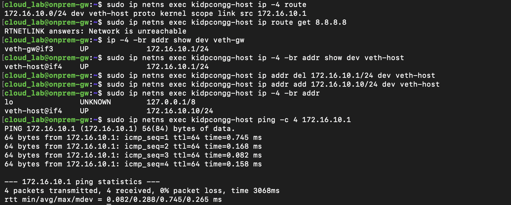
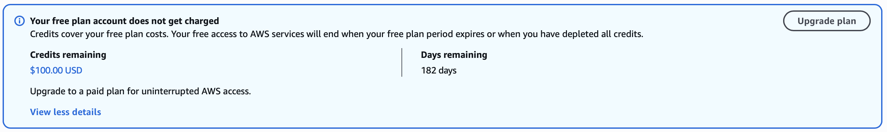
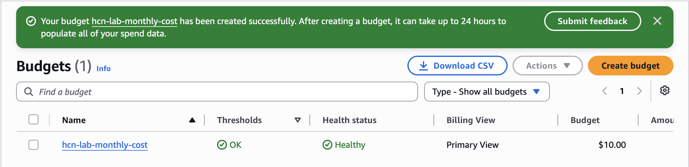

## Fixing a duplicate IP assignment in the local LAN

- Date: 2026-09-10
- Problem: both veth-gw and veth-host were assigned 172.16.10.1/24.
  Pinging that address inside the namespace reached the namespace itself.
- Fix: changed veth-host inside kidpcongg-host to 172.16.10.10/24.
  Kept veth-gw at 172.16.10.1/24.
- Verification: confirmed the new address and received 4/4 ping replies
  from 172.16.10.1 across the veth link.
- Separate finding: the namespace had no route to 8.8.8.8.
  Internet connectivity has not been configured or verified.
- Lesson: check interface addresses before treating a successful ping
  as proof of connectivity between two endpoints.

## AWS account baseline - 2026-09-12

- Confirmed Free plan status.
- Remaining credit: USD 100.
- Remaining Free plan duration: 182 days.
- These values reflect the account state on the capture date.

## AWS budget setup — 2026-09-13

- Created hcn-lab-monthly-cost with a recurring monthly budget of USD 10.
- Configured actual-cost email alerts at 50% and 100%.
- No automated budget actions were attached.
- Credit exclusion is pending because charge-type filter data was unavailable.
- This budget sends alerts; it does not enforce a spending cap.

## AWS network foundation — 2026-09-13

Created the network foundation for the hybrid cloud lab
in the Singapore region (ap-southeast-1).

The lab VPC uses 10.10.0.0/16.

### Subnets

| Evidence | Configuration and purpose |
|---|---|
| [Public subnet](aws-subnet-public-created.png) | Created hcn-public-a with CIDR 10.10.1.0/24 for the VPN gateway. |
| [Private subnet](aws-subnet-private-created.png) | Created hcn-private-a with CIDR 10.10.10.0/24 for a future application server. |

A subnet's name does not make it public or private.
Its associated route table determines whether it has
a direct route to an Internet Gateway.

### Internet Gateway and routing

| Evidence | Configuration and purpose |
|---|---|
| [Internet Gateway attached](aws-internet-gateway-attached.png) | Attached hcn-igw to the lab VPC. |
| [Public route table](aws-public-route-table-created.png) | Created hcn-public-rt to manage routing for the public subnet. |
| [Default route](aws-public-route-created.png) | Added 0.0.0.0/0 toward hcn-igw for destinations outside the VPC. |
| [Subnet association](aws-public-subnet-associated.png) | Explicitly associated hcn-public-a with hcn-public-rt. |

The public route table contains:

| Destination | Target | Purpose |
|---|---|---|
| 10.10.0.0/16 | local | Routing within the VPC. |
| 0.0.0.0/0 | hcn-igw | Default route toward the internet. |

Internet access also requires suitable instance addressing
and firewall rules; the default route alone is not sufficient.

The private subnet uses the main route table, which at this
stage has only the VPC local route and no internet default route.

### VPN security group

[VPN security group](aws-vpn-security-group-created.png)

Created hcn-vpn-sg for the EC2 VPN gateway.

The rules used for the connectivity tests on 2026-09-14 were:

| Direction | Protocol / port | Source or destination | Purpose |
|---|---|---|---|
| Inbound | TCP 22 | Current home public IPv4 /32 | SSH administration. |
| Inbound | UDP 51820 | Current home public IPv4 /32 | WireGuard connectivity. |
| Outbound | All traffic | 0.0.0.0/0 | Outbound IPv4 traffic for this lab. |

The screenshot records the configuration at capture time.
The inbound source was subsequently updated when the home
public IPv4 changed.

## EC2 SSH access — 2026-09-14

[Successful SSH login](aws-ec2-ssh-success-2026-09-14.png)

- Launched hcn-vpn-gw using Ubuntu Server 24.04 LTS
  and a t3.micro instance in the public subnet.
- Connected from the Mac using an SSH key and user ubuntu.
- Verified the remote hostname and private interface address.
- Resolved an SSH timeout by updating the security group's
  source /32 to the current home public IPv4.

This verifies administrative access to the EC2 instance.
It does not by itself verify VPN connectivity.

## WireGuard tunnel — 2026-09-14

[WireGuard handshake and ping](wireguard-tunnel-ping-success-2026-09-14.png)

Established a WireGuard tunnel between the local Ubuntu VM
and the AWS EC2 gateway.

| Endpoint | Tunnel address |
|---|---|
| AWS gateway | 10.200.0.1/30 |
| Local Ubuntu gateway | 10.200.0.2/30 |

- AWS listens on UDP 51820.
- The local peer initiates the connection to the EC2 public IPv4.
- PersistentKeepalive is set to 25 seconds on the local peer
  to maintain the NAT mapping.
- Verified a recent handshake and transfer counters.
- Tested ping between the tunnel addresses in both directions:
  each test received 4/4 replies.

### Configuration issue resolved

Loading the private key through PreUp failed because wg0
did not yet exist on the installed wg-quick version.

Changed the hook to PostUp so the private key is loaded
after interface creation.

Private keys remain on their respective machines and are
not included in this repository.

## Simulated LAN host to AWS — 2026-09-14

### Local topology

| Component | Interface | Address |
|---|---|---|
| Local Ubuntu gateway | veth-gw | 172.16.10.1/24 |
| Host in namespace kidpcongg-host | veth-host | 172.16.10.10/24 |

Configured:

- A route in the namespace to 10.200.0.0/30
  via 172.16.10.1.
- IPv4 forwarding on the local Ubuntu gateway.
- The local FORWARD chain had an ACCEPT policy.
- Added 172.16.10.0/24 to the AWS WireGuard peer's
  AllowedIPs, providing a return route through wg-quick
  and authorizing that source range for the peer.

### End-to-end ping

[Namespace ping to AWS](onprem-host-to-aws-vpn-ping-success-2026-09-14.png)

Ran from the local Ubuntu VM:

    sudo ip netns exec kidpcongg-host ping -c 4 10.200.0.1

Result: 4 packets transmitted, 4 received, 0% packet loss.

This verifies connectivity from the simulated LAN host
through the local gateway and WireGuard to the AWS
gateway's tunnel address.

### Packet capture on AWS

[ICMP capture on AWS wg0](aws-wg0-host-icmp-capture-2026-09-14.png)

Ran on the AWS gateway:

    sudo tcpdump -ni wg0 icmp

Observed four echo requests and four matching echo replies
between 172.16.10.10 and 10.200.0.1.

The original host source address, 172.16.10.10, was preserved.
No source NAT was required for this tested path.

This capture shows inner IP traffic on wg0.
It does not show the encrypted outer UDP packets.

An earlier ping attempt received no replies. The subsequent
test succeeded; the cause of that initial failure was not
established.

## Status and remaining work

As of 2026-09-14:

- Verified EC2 SSH access.
- Verified the WireGuard tunnel in both directions.
- Verified simulated LAN host connectivity to the AWS
  gateway's tunnel address.
- Saved local IPv4 forwarding configuration in
  /etc/sysctl.d/99-hcn-forwarding.conf.
- Enabled local wg-quick@wg0 autostart.
- Reboot persistence has not yet been tested.
- The namespace, veth pair and namespace route still need
  recreation after the local VM reboots.
- AWS WireGuard autostart has not yet been configured.
- The EC2 public IPv4 may change after stop/start;
  the local Endpoint must then be updated.
- Connectivity to an application in the AWS private subnet
  has not yet been implemented or tested.
- Terraform automation and VPC Flow Logs remain future work.
